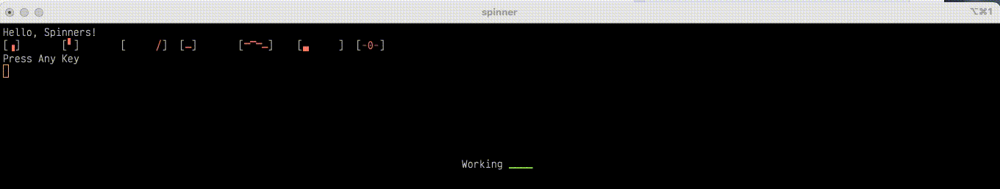

# Text Based Spinners

<div align="center">
    A little package to create .NET CLI spinners.

  

</div>

---

This project holds a small .NET based class that presents an activity / spinner control on the command line.

[](https://opensource.org/licenses/MIT)

## Purpose of this Library

Small utilities and tools are frequently written using the command line as their user interface. Often these tools can have long-running phases which are best executed in the background, with the user offered some visual feedback that the tool continues to run.

## The Code

All of the spinner code can be found in the `TextSpinner.cs` file. The `Program.cs` file 
The simplest version of the spinner code requires very little:

```csharp
var cts = new CancellationTokenSource();
var ct = cts.Token;

var tmpSpinner = new TextSpinner(TextSpinner.SpinnerStyle.Growing);
var tsk = tmpSpinner.Start(ct);
tsk.Wait(100);

// Some time later ...

cts.Cancel();
```

This will create a simple wait spinner on the next line on the terminal and then start it animating.

The `Wait` command is required to allow the spinner's task the opportunity to start - it is asynchronous, but doesn't necessarily consume a dedicated thread.

Similarly, the `CancellationTokenSource` is necessary to signal the task to complete. Remember to call the `Cancel()` method to cleanly exit the spinner task.

### Spinner Styles

The spinner supports a couple fo styles, which are defined in the `SpinnerStyle` enumeration:

* **Corners**

  Creates a spinner that moves a small square from corner to corner

* **Growing**

  Creates a spinner that moves a small square from corner to corner with the movement animated to grow between the corners

* **Spinning**

  Creates a wide spinner that animates a spin from right to left

* **Scanning**

  Creates a spinner that animates a scan line from top to bottom

* **Rolling**

  Creates a wide spinner that animates a wave formation

* **Bounce**

  Creates a wide spinner that animates a square from left to right and back again

* **Numbers**

  Creates a small spinner that counts from 0 to 9 in a loop

The foreground colour of the spinner can be set using the `SetSpinnerColour` method which accepts a `ConsoleColor` parameter.

### Spinner Speed

Each spinner animates based on iterating through a series of frames with a short delay between each frame. The delay can be altered by calling the `SetSpinnerSpeed` method. There are two forms of this method, the first takes a specific integer value that specifies the delay, in milliseconds, between each frame.

The second takes a `SpinnerSpeed` parameter that reflects the visual speed of the spinner:

* Sprinting
* Running
* Jogging
* Walking
* Strolling
* Crawling

### Spinner Location

By default, the spinner will be located on the next line in the leftmost position in the terminal (apologies to readers from locales with right to left reading). A new location can be set using the `SetPosition` method. There are two forms of this method, the first takes a specific left position and top position (reflecting the coordinates returned from `Console.GetCursorPosition()` method.

The second takes a `SpinnerJustification` parameter that provides the ability to position the spinner relative to the terminal including: 

* Left
* Centre
* Right

## Conclusions

I've used this code in a couple of projects, but just to be clear, it's a bit of eye candy for CLI / Terminal / Bash based tools. I don't consider it industrial strength, or even _production ready_ however you may interpret that phrase.

Feel free to take it, adapt it and use it as you see fit. If you have feedback or comments, I'm always interested to hear at [david\@xorcon.ie](mailto:david@xorcon.ie)